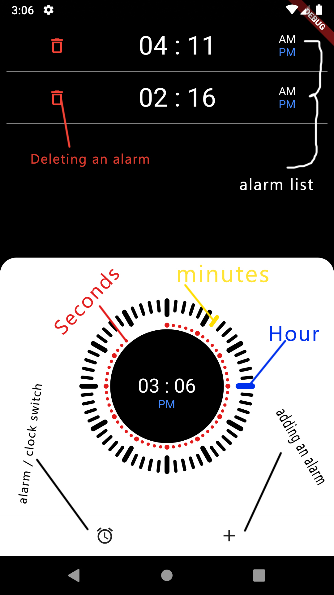
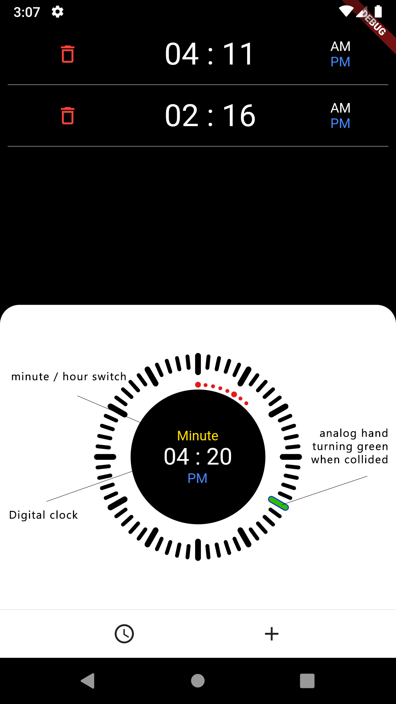
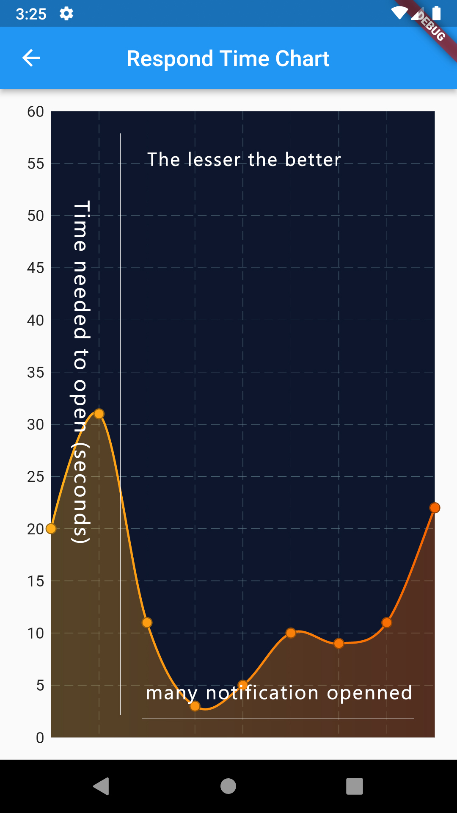

# simple_alarm_app

A new Flutter project.

## Getting Started

It's an alarm with analog clock face and digital indicator in the center for easier to use.

Legend:
 1. Red Dot is seconds clock hand,
    
 2. Yellow Dash is minute clock hand (turn green when collided with hour),
    
 3. Blue Dash is Hour clock hand (turn green when collided with minute),
    
 4. List of active alarm shown on top of the screen,
    
 5. Delete icon used to delete/cancel of the notification,
    
 6. PM/AM is a PM/AM indicator of the clock (clickable on alarm mode),
    
 7. Digital clock face in the middle for easier to use (HH:MM),
    
 8. Clock or Alarm icon on bottom navigation used to change between clock or alarm mode,
    
 9. plus icon on bottom navigation is used to add a notification to the list,
    
10. Statistic page showing chart of time needed to open notification (can only reached by clicking notification),
    

Demonstration link video: [youtube](https://youtu.be/TDgAHsgq5hI)
